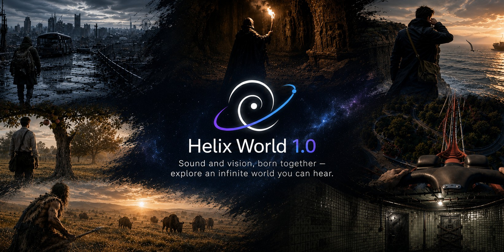

<p align="center">
  
</p>

# HelixWorld

**HelixWorld 1.0** is a real-time interactive audio-visual world model from [Noiz AI](https://noiz.ai).

Give it an image and a prompt. Walk forward or turn around — picture and sound update together. The spatial field turns with the camera. Audio is not a soundtrack laid on afterwards.

> Weights, inference code, and the technical report ship in the coming weeks.

<p align="center">
  
  
  <a href="LICENSE"></a>
</p>

## Highlights

| | HelixWorld 1.0 |
| --- | --- |
| Roaming / camera navigation | Yes |
| Real-time interaction | Yes |
| Joint audio-video | Yes |
| Spatial sound field | Follows viewpoint |
| Weights and code | Coming soon |

## Code

Coming Soon.

## Method

Four stages. Details, figures, and ablations ship with the report.

```text
spatial AV data  →  joint generation + action
                 →  causal rollout
                 →  distillation for realtime
```

1. **Spatial AV data.** First-person real-world video (on-location sound) plus game-engine captures with known geometry and listener pose.
2. **Joint generation + action.** The model predicts the next picture and sound from the current state and the user's action.
3. **Causal rollout.** Interaction cannot look ahead. The generator is causal, and trained to keep going from its own history.
4. **Realtime.** Joint generation is distilled so action, decode, and AV output can run as a pipeline.

## Citation

```bibtex
@misc{helixworld2026,
  title        = {HelixWorld: A Real-Time Interactive Audio-Visual World Model},
  author       = {{Noiz AI}},
  year         = {2026},
  howpublished = {\url{https://github.com/NoizAI/HelixWorld}},
  note         = {Weights and code forthcoming}
}
```

## License

Code is [Apache 2.0](LICENSE). The weight license will be published with the checkpoint.
